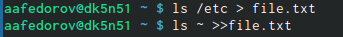
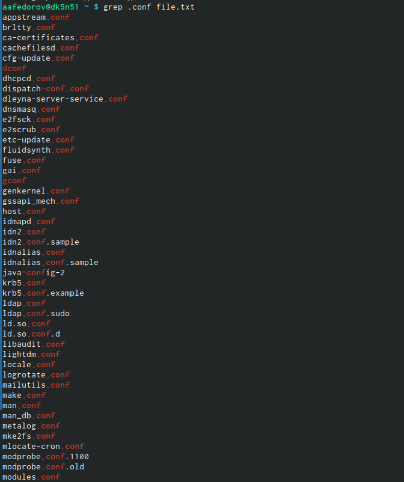
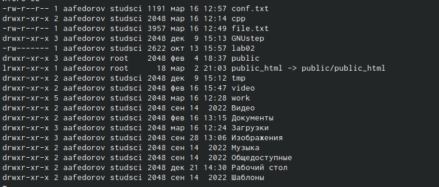
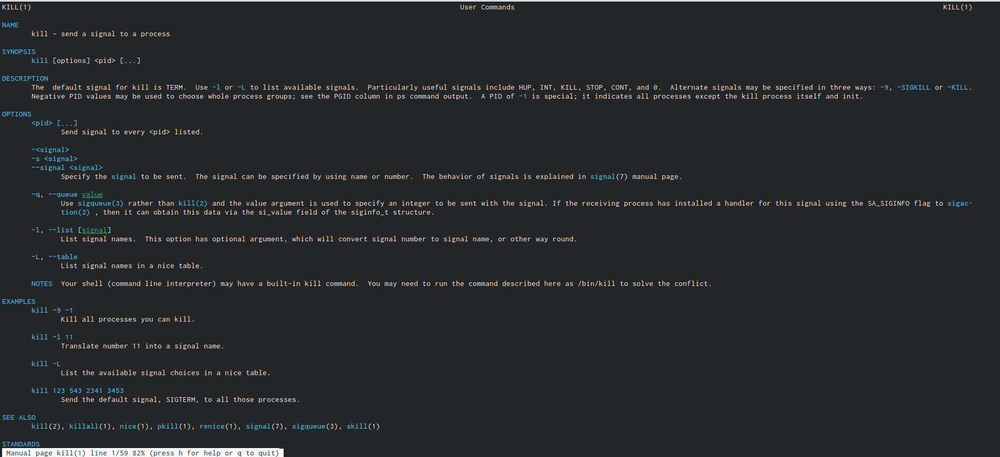
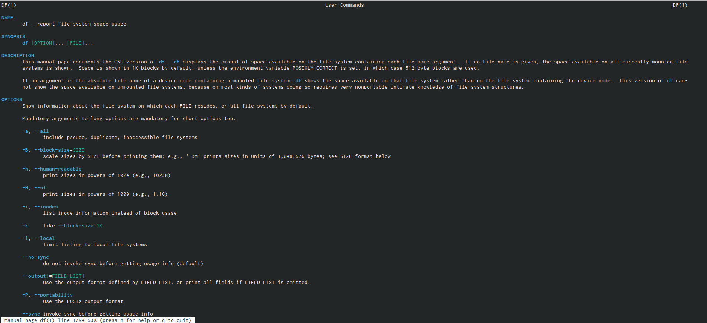
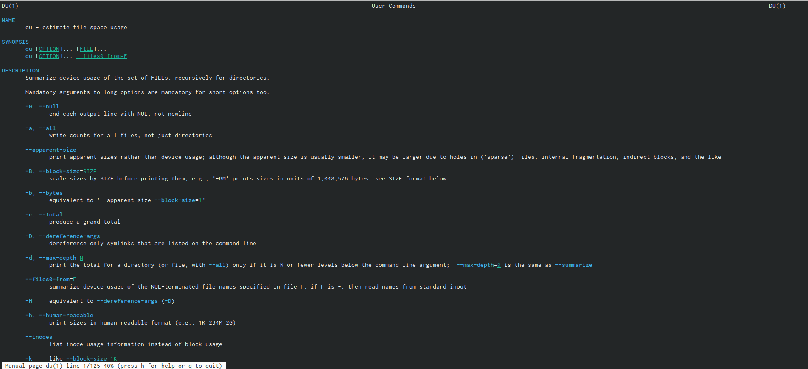
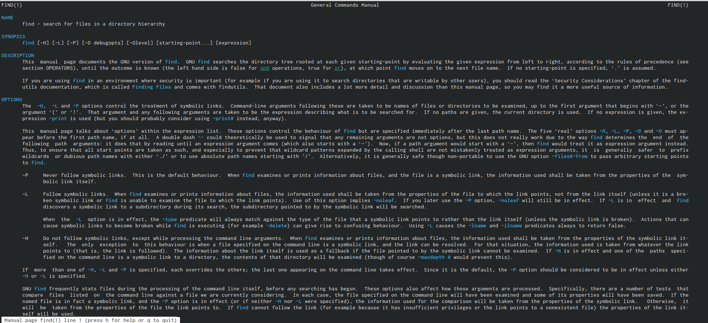
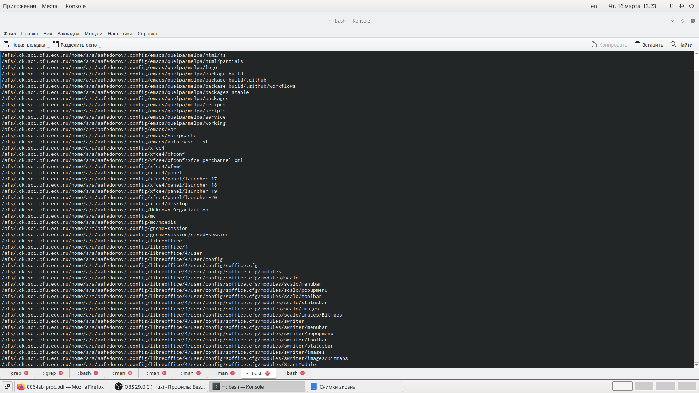

---
## Front matter
lang: ru-RU
title: Лаборатрная рабта №1
subtitle: Простейший шаблон
author:
  - Федоров Андрей
institute:
  - Российский университет дружбы народов, Москва, Россия
date: 16 марта 2023

## i18n babel
babel-lang: russian
babel-otherlangs: english

## Formatting pdf
toc: false
toc-title: Содержание
slide_level: 2
aspectratio: 169
section-titles: true
theme: metropolis
header-includes:
 - \metroset{progressbar=frametitle,sectionpage=progressbar,numbering=fraction}
 - '\makeatletter'
 - '\beamer@ignorenonframefalse'
 - '\makeatother'
---

# Информация

## Докладчик

:::::::::::::: {.columns align=center}
::: {.column width="70%"}

  * Федоров Андрей Андреевич
  * студент группы НБИбд-03-22
  * Российский университет дружбы народов


:::
::::::::::::::

# Вводная часть

## Актуальность

Лабораторная работа актуальна для тех, кто желаем освоить GitHub.

## Объект и предмет исследования

- Презентация как текст
- Программное обеспечение для создания презентаций
- Входные и выходные форматы презентаций

## Цели и задачи

- Изучить идеологию и применение средств контроля версий.
- Освоить умения по работе с git.

## Материалы и методы

- Процессор `pandoc` для входного формата Markdown
- Результирующие форматы
	- `pdf`
	- `html`
- Автоматизация процесса создания: `Makefile`

# Создание презентации

## Процессор `pandoc`

- Pandoc: преобразователь текстовых файлов
- Сайт: <https://pandoc.org/>
- Репозиторий: <https://github.com/jgm/pandoc>

## Формат `pdf`

- Использование LaTeX
- Пакет для презентации: [beamer](https://ctan.org/pkg/beamer)
- Тема оформления: `metropolis`

## Код для формата `pdf`

```yaml
slide_level: 2
aspectratio: 169
section-titles: true
theme: metropolis
```

## Формат `html`

- Используется фреймворк [reveal.js](https://revealjs.com/)
- Используется [тема](https://revealjs.com/themes/) `beige`

## Код для формата `html`

- Тема задаётся в файле `Makefile`

```make
REVEALJS_THEME = beige 
```
# Результаты

## Получающиеся форматы

- Полученный `pdf`-файл можно демонстрировать в любой программе просмотра `pdf`
- Полученный `html`-файл содержит в себе все ресурсы: изображения, css, скрипты
.

## Содержание исследования

1. Я осуществил вход в систему, используя соответствующее имя пользователя. Записал в файл file.txt названия файлов, содержащихся в каталоге /etc. Дописал в этот же файл названия файлов, содержащихся в моём домашнем каталоге. (рис. [-@fig:001])

{#fig:001 width=90%}

##

2. Ввёл имена всех файлов из file.txt, имеющих расширение .conf, после чего записал их в новый текстовой файл conf.txt.. (рис. [-@fig:002])

{#fig:002 width=90%}

##

3. Определил, какие файлы в вашем домашнем каталоге имеют имена, начинавшиеся с символа c? Предложил несколько вариантов, как это сделать. ВЫвел на экран (по странично) имена файлов из каталога /etc, начинающиеся с символа h. Запустил в фоновом режиме процесс, который будет записывать в файл ~/logfile файлы, имена которых начинаются с log. Удалил файл ~/logfile. (рис. [-@fig:003])

{#fig:003 width=90%}

##

4. Посмотрел команды kill du df find с помощью команды man. (рис. [-@fig:004]) 

{#fig:004 width=90%}

{#fig:005 width=90%}

##

{#fig:006 width=90%}

{#fig:007 width=90%}

##

5. С помощью справки команды find, ввёл имена всех директорий, имеющихся в моём домашнем каталоге. (рис. [-@fig:005])

{#fig:008 width=90%}

##

# Вопросы для самопроверки

1. Какие потоки ввода вывода вы знаете?
2. Объясните разницу между операцией > и >>.
3. Что такое конвейер?
4. Что такое процесс? Чем это понятие отличается от программы?
5. Что такое PID и GID?
6. Что такое задачи и какая команда позволяет ими управлять?
7. Найдите информацию об утилитах top и htop. Каковы их функции?
8. Назовите и дайте характеристику команде поиска файлов. Приведите примеры ис-
пользования этой команды.
9. Можно ли по контексту (содержанию) найти файл? Если да, то как?
10. Как определить объем свободной памяти на жёстком диске?
11. Как определить объем вашего домашнего каталога?
12. Как удалить зависший процесс?

##

# Ответы на вопросы

1. В системе по умолчанию открыто три специальных потока: – stdin — стан-
дартный поток ввода (по умолчанию: клавиатура), файловый дескриптор 0;
– stdout — стандартный поток вывода (по умолчанию: консоль), файловый
12дескриптор 1; – stderr — стандартный поток вывод сообщений об ошибках
(по умолчанию: консоль), файловый дескриптор 2.
2. • перенаправление stdout (вывода) в файл. Если файл отсутство- вал, то он
создаётся, иначе - перезаписывается. • перенаправление stdout (вывода) в
файл. Если файл от- сутствовал, то он создаётся, иначе - добавляется.
3. Конвейер (pipe) служит для объединения простых команд или утилит в
цепочки, в которых результат работы предыдущей команды передаётся
последующей.
4. Процесс это - совокупность программного кода и данных, загруженных
в память ЭВМ. Любой команде, выполняемой в системе, присваивается
идентификатор процесса (process ID). Получить информацию о процессе и
управлять им, пользуясь идентификатором процесса, можно из любого окна
командного интерпретатора. Процессом называют выполняющуюся про-
грамму и все её элементы: адресное пространство, глобальные переменные,
регистры, стек, открытые файлы и так далее.
5. PID — уникальный номер (идентификатор) процесса в многозадачной ОС.
GID – идентификатор группы. 18
6. Любую выполняющуюся в консоли команду или внешнюю программу мож-
но запустить в фоновом режиме. Запущенные фоном программы называют-
ся задачами (jobs). Ими можно управлять с помощью команды jobs, которая
выводит список запущенных в данный момент задач. Для завершения за-
дачи необходимо выполнить команду kill %номер задачи.
7. Команда top в Linux системах позволяет вывести в виде таблицы перечень
запущенных процессов и оценить, какой объем ресурсов они потребляют,
т.е., какую нагрузку создают на сервер и дисковую подсистему. Команда htop
— продвинутый монитор процессов, показывает динамический список си-
стемных процессов, список обычно выравнивается по использованию ЦПУ.
В отличие от top, htop показывает все процессы в системе. Также показыва-
ет время непрерывной работы, использование процессоров и памяти. htop
13часто применяется в тех случаях, когда информации даваемой утилитой
top недостаточно, например при поиске утечек памяти в процессах.
8. Команда find используется для поиска и отображения имён файлов, соответ-
ствующих заданной строке символов. Формат команды: find путь [-опции]
Путь определяет каталог, начиная с которого по всем подкаталогам будет
вестись поиск. Примеры: • вывести на экран имена файлов из вашего до-
машнего каталога и его подка- талогов, начинающихся на f: find ~ -name
“f” -print • вывести на экран имена файлов в каталоге /etc, начинающихся
с символа p: find /etc -name “p” -print • найти в вашем домашнем каталоге
файлы, имена которых заканчиваются символом и удалить их: find ~ -name
“*~” -exec rm “{}” ;
9. Найти файл по контексту (содержанию) позволяет команда grep. Формат ко-
манды: grep строка имя_файла Примеры: • показать строки во всех файлах
в вашем домашнем каталоге с именами, начинающимися на f, в которых
есть слово begin: grep begin f* 19 • найти в текущем каталоге все файлы, в
имени которых есть буквосочетание «лаб»: ls -l | grep лаб
10. Определить объем свободной памяти на жёстком диске позволяет команда
df.
11. Определить объем домашнего каталога позволяет команда df /home/
12. Удалить зависший процесс можно командой kill %номер задачи.

##

# Выводы

- Я познакомился с инструментами поиска файлов и фильтрации текстовых данных и приобрёл практических навыков: по управлению процессами (и заданиями), попроверке использования диска и обслуживанию файловых систем.

## Результаты

- Я познакомился с инструментами поиска файлов и фильтрации текстовых данных и приобрёл практических навыков: по управлению процессами (и заданиями), попроверке использования диска и обслуживанию файловых систем.

## Итоговый слайд

- Я научился спасибо РУДН ОГРОМНОЕ


